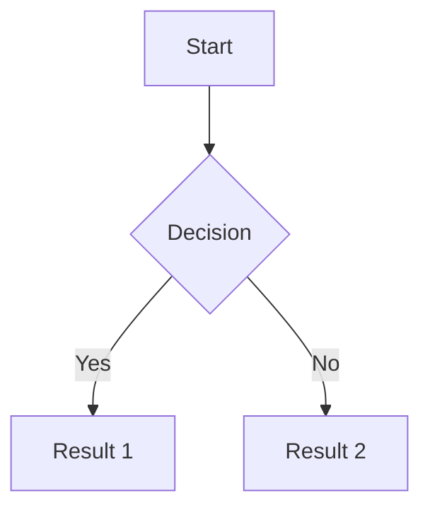
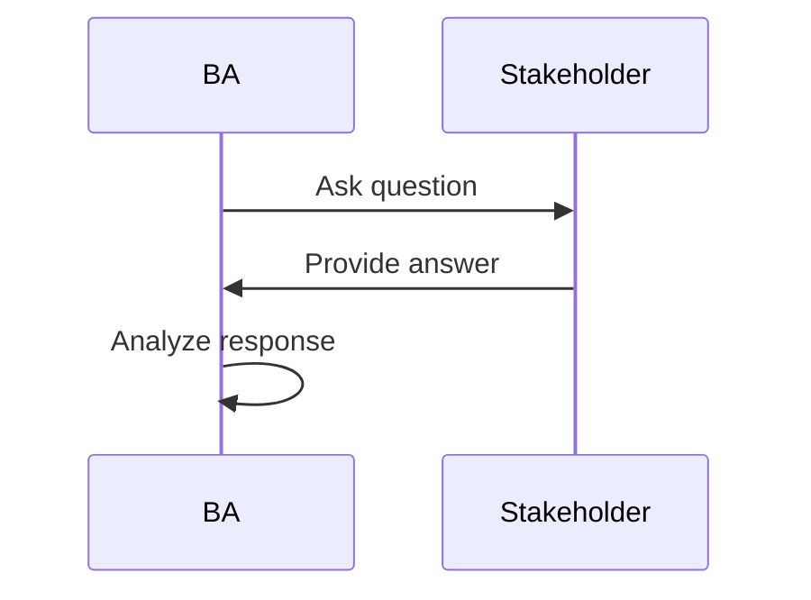
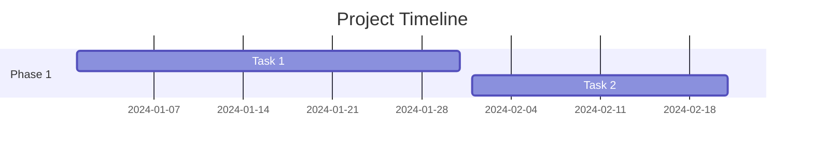
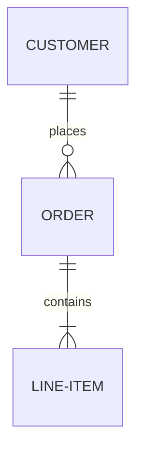

# Quick Start Guide

Get started writing "The Junior BA's Practical Guide" in AsciiDoc format.

## Initial Setup

### 1. Install Dependencies

```bash
# Install Ruby (if not already installed)
# On Ubuntu/Debian:
sudo apt-get install ruby-full

# On macOS:
brew install ruby

# Install Asciidoctor and extensions
gem install asciidoctor asciidoctor-diagram asciidoctor-pdf asciidoctor-epub3

# For Mermaid diagrams (optional but recommended)
npm install -g @mermaid-js/mermaid-cli
```

### 2. Verify Installation

```bash
asciidoctor --version
# Should show: Asciidoctor 2.x.x

make check-deps
# Should confirm all dependencies installed
```

## Writing Your First Chapter

### Option 1: Use the Template

```bash
# Copy the template
cp book/chapters/_template.adoc book/chapters/chapter-02.adoc

# Edit in your preferred editor
vim book/chapters/chapter-02.adoc
# or
code book/chapters/chapter-02.adoc
```

### Option 2: Study the Example

Open `book/chapters/chapter-01.adoc` to see a complete, fully-written chapter demonstrating:

- Proper AsciiDoc formatting
- Mermaid diagram integration
- Real examples with dialogue
- Exercise structures
- All required sections

### Key Files to Reference

1. **`book/chapters/_template.adoc`** - Empty chapter template with all required sections
2. **`book/chapters/chapter-01.adoc`** - Complete example chapter
3. **`implementation_guide.md`** - Detailed writing guidelines and quality standards
4. **`CLAUDE.md`** - Technical documentation for AI assistance

## Building the Book

### Quick Build (HTML only, no diagrams)

```bash
make quick
```

Output: `output/junior-ba-guide.html`

### Full Build (HTML with diagrams)

```bash
make html
```

### Build PDF

```bash
make pdf
```

Output: `output/junior-ba-guide.pdf`

### Build All Formats

```bash
make all
```

Generates both HTML and PDF.

### Auto-Rebuild on Changes

```bash
# Install entr first:
# Ubuntu/Debian: sudo apt-get install entr
# macOS: brew install entr

# Watch for changes
make watch
```

Now edit `.adoc` files and the HTML will auto-rebuild.

## Writing Workflow

### Recommended Process

1. **Plan the chapter** using `book_structure.md` as reference
2. **Copy template** to new chapter file
3. **Fill in "At a Glance"** section with learning objectives
4. **Write "Core Concepts"** - the theory portion (30%)
5. **Create "Real Example"** - extended scenario (this is critical!)
6. **Design exercises** - hands-on practice
7. **Build and review** - check formatting with `make quick`
8. **Refine** - improve based on review

### Quality Checklist Before Completing a Chapter

Use this checklist (from implementation_guide.md):

- [ ] All concepts clearly explained in plain language
- [ ] Examples are realistic with specific details (names, numbers, dialogue)
- [ ] At least one extended real example (5-10 paragraphs minimum)
- [ ] Exercises are complete with clear success criteria
- [ ] Common pitfalls identified with solutions
- [ ] Conversational, mentoring tone throughout
- [ ] Follows chapter template structure
- [ ] Proper AsciiDoc formatting (builds without errors)
- [ ] Key takeaways summarize learning effectively

## AsciiDoc Syntax Quick Reference

### Headings

```asciidoc
= Document Title (Level 0 - use only in main.adoc)
== Chapter/Section (Level 1)
=== Subsection (Level 2)
==== Sub-subsection (Level 3)
```

### Text Formatting

```asciidoc
*bold text*
_italic text_
`monospace/code`
```

### Lists

```asciidoc
* Unordered item 1
* Unordered item 2

1. Ordered item 1
2. Ordered item 2
```

### Admonitions (Callout Boxes)

```asciidoc
[TIP]
====
Pro tip content here
====

[WARNING]
====
Watch out for this!
====

[NOTE]
====
Important information
====

[IMPORTANT]
====
Critical information
====
```

### Tables

```asciidoc
[cols="1,2,3", options="header"]
.Table Title
|===
|Column 1 |Column 2 |Column 3

|Cell 1
|Cell 2
|Cell 3

|Cell 4
|Cell 5
|Cell 6
|===
```

### Mermaid Diagrams

```asciidoc
[mermaid]
....
graph TD
    A[Start] --> B[Decision]
    B -->|Yes| C[Action 1]
    B -->|No| D[Action 2]
....
```

### Code Blocks

```asciidoc
[source,python]
----
def hello():
    print("Hello, World!")
----
```

### Cross References

```asciidoc
See <<chapter-02>> for more details.

[[chapter-02]]
== Chapter 2: Title
```

### Quotes

```asciidoc
[quote, Person Name, Context]
____
The quote text goes here.
____
```

### Sidebar Blocks

```asciidoc
[sidebar]
.Sidebar Title
****
Sidebar content in a box
****
```

## Mermaid Diagram Types

### Flowchart



### Sequence Diagram



### Gantt Chart



### Entity Relationship Diagram



## Common Tasks

### Add a New Chapter

```bash
# Create from template
cp book/chapters/_template.adoc book/chapters/chapter-XX.adoc

# Edit the file
vim book/chapters/chapter-XX.adoc

# Add to main.adoc (around line 70+)
# Add this line in the appropriate Part section:
# include::chapters/chapter-XX.adoc[]
```

### Add a New Part Introduction

```bash
# Create part intro
vim book/part-XX/part-XX-intro.adoc

# Use part-01-intro.adoc as reference
```

### Add Images

```bash
# Place image in book/images/
cp mydiagram.png book/images/

# Reference in AsciiDoc:
# image::mydiagram.png[Alt text, width=600]
```

### Preview Changes

```bash
# Build HTML
make html

# Open in browser
xdg-open output/junior-ba-guide.html  # Linux
open output/junior-ba-guide.html      # macOS
```

## Getting Help

### Documentation References

1. **AsciiDoc Syntax:** https://docs.asciidoctor.org/asciidoc/latest/
2. **Asciidoctor User Manual:** https://docs.asciidoctor.org/asciidoctor/latest/
3. **Mermaid Diagrams:** https://mermaid.js.org/intro/
4. **This project:**
   - `CLAUDE.md` - AI assistant guidance
   - `implementation_guide.md` - Writing standards
   - `book_structure.md` - Complete book outline

### Troubleshooting

**Build errors:**
```bash
# Validate AsciiDoc syntax
make validate

# Clean and rebuild
make clean
make html
```

**Mermaid diagrams not rendering:**
- Check that `mmdc` is installed: `mmdc --version`
- Verify diagram syntax at https://mermaid.live/
- Ensure proper block delimiters: `....` (4 dots)

**Missing includes:**
- Verify file paths in `main.adoc`
- Check that referenced files exist
- Use relative paths from `book/` directory

## Next Steps

1. ✅ Review `book/chapters/chapter-01.adoc` - see complete example
2. ✅ Read `implementation_guide.md` - understand quality standards
3. ✅ Copy `_template.adoc` for next chapter
4. ✅ Write following the template structure
5. ✅ Build frequently with `make quick` to check formatting
6. ✅ Use `make html` for final review with diagrams

Happy writing!
